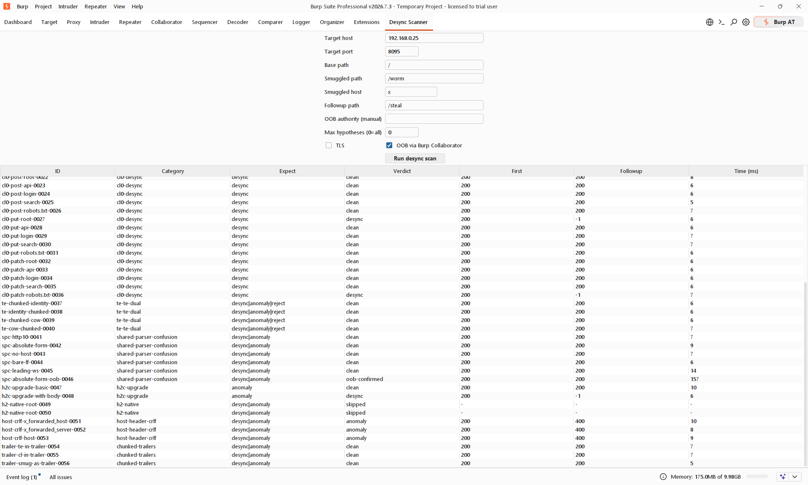

# Desync Hypothesis Scanner (Burp extension)

A Burp Suite Professional extension (Montoya API) that fuzzes HTTP request-smuggling /
desync hypotheses against a target and classifies the outcome with an oracle-free,
framing-aware classifier. Port of the GGSec Cortex CSD engine.

**Author:** Maciej Gojny — GG Advanced IT Security UG
**License:** MIT

> ⚠️ Intrusive: it sends deliberately malformed HTTP framing and can poison connections.
> Only run it against systems you are authorized to test.



## Features

- ~56 hypotheses across TE obfuscation, duplicate/CL.0, chunk anomalies, chunked
  trailers, dual-TE, shared-parser-confusion, host-header CRLF, h2c upgrade, and more.
- Framing-aware classifier: `desync` requires a genuinely queued second response
  (response #1 is parsed by its own Content-Length/chunked framing) or a response-identity
  mismatch on the follow-up slot — not fragile substring counting.
- Out-of-band SSRF / routing-confusion detection via **Burp Collaborator**.
- Suite tab UI + right-click "quick" context-menu scan.

## Download

Grab the prebuilt `desync-hypothesis-burp.jar` from the [Releases](../../releases) page
(attached to every tagged release), or build it from source below.

## Build

Requires JDK 17+. The Gradle wrapper is included.

```bash
./gradlew jar
```

Output: `build/libs/desync-hypothesis-burp.jar`
(`montoya-api` is a `compileOnly` dependency provided by Burp at runtime, so a plain jar
is enough — no shadow/fat jar needed.)

Run the tests:

```bash
./gradlew test
```

CI builds and tests on every push/PR (`.github/workflows/build.yml`).

## Load in Burp

Burp → Extensions → Add → Java → `build/libs/desync-hypothesis-burp.jar`

## Usage

- **Tab "Desync Scanner":** set target host/port/TLS, tune paths, "Run desync scan".
- **Right-click a request → "Run desync hypotheses (quick)":** logs results to Output.
  The quick scan is capped (`generate(20)`) but samples round-robin across ALL families
  (TE, CL-dup, chunk, SPC/OOB, host-crlf, trailers, h2-native, …), not just the first few.

## Verdicts

| Verdict         | Meaning |
|-----------------|---------|
| `desync`        | Response #1 (parsed by its own CL/chunked framing) is followed by a genuinely queued second response, OR the follow-up slot served the *smuggled* resource instead of the expected one (identity match — catches "quiet 200/200" queue poisons). |
| `anomaly`       | Follow-up status differs from the first, or the follow-up timed out. |
| `reject`        | First response was 400/501 (short-circuits without the follow-up). |
| `clean`         | No smuggling signal. |
| `oob-confirmed` | Absolute-form authority was fetched out-of-band (HTTP callback). |
| `oob-dns`       | DNS-only lookup of the OOB authority (weaker — verify manually). |
| `timeout` / `break` / `error` | Transport-level outcomes. |

## OOB (SSRF / routing confusion)

With "OOB via Burp Collaborator" enabled (default), each scan spins up its own
Collaborator client, injects a fresh payload as the absolute-form authority, and polls
`getAllInteractions()` after the run. An HTTP callback → `oob-confirmed`; a bare DNS
lookup → `oob-dns`.

> The extension's Collaborator client is separate from the interactive Collaborator tab,
> so callbacks appear in **Extensions → Output** (logged with type, source IP and
> path/token), NOT in the Collaborator tab's poll view.

## Identity baseline

At the start of each tab scan, the smuggled path and the follow-up path are each probed
once on a clean connection and fingerprinted (status + body length + body checksum). Those
fingerprints let the classifier decide which resource actually answered on the follow-up
slot. The quick context-menu scan skips this (no baseline).

## Implementation notes

- Response reads drain until a ~700 ms quiet gap (not until the socket is momentarily
  empty), so a queued second response arriving a few ms after the first still lands in the
  same buffer. This makes each probe take ~1 s+ but is what makes the queued-response
  signal reliable.
- Both the TCP connect and the TLS handshake are bounded by the connect timeout, so a host
  that accepts TCP but stalls the handshake surfaces as `timeout`, not a hung thread.
- Malformed hypotheses (dangling-byte, chunk-oversize) intentionally hang the origin, so
  those rows take ~6 s (first-read timeout) before showing `timeout`.
- `h2-native` (real HTTP/2 HEADERS frames + HPACK for H2.CL / H2.TE) is generated but
  skipped at replay — it needs a dedicated binary HTTP/2 frame engine that the Montoya API
  does not expose. Such rows show verdict `skipped`.
